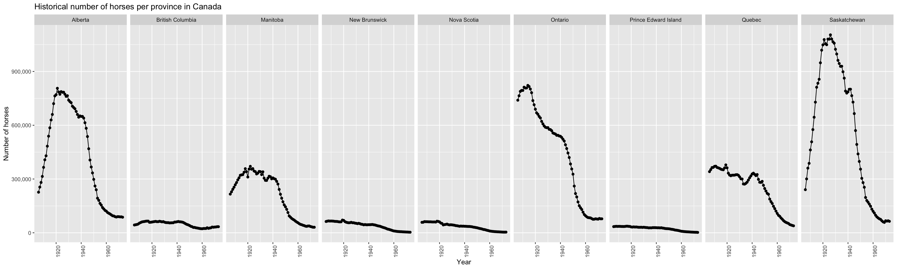
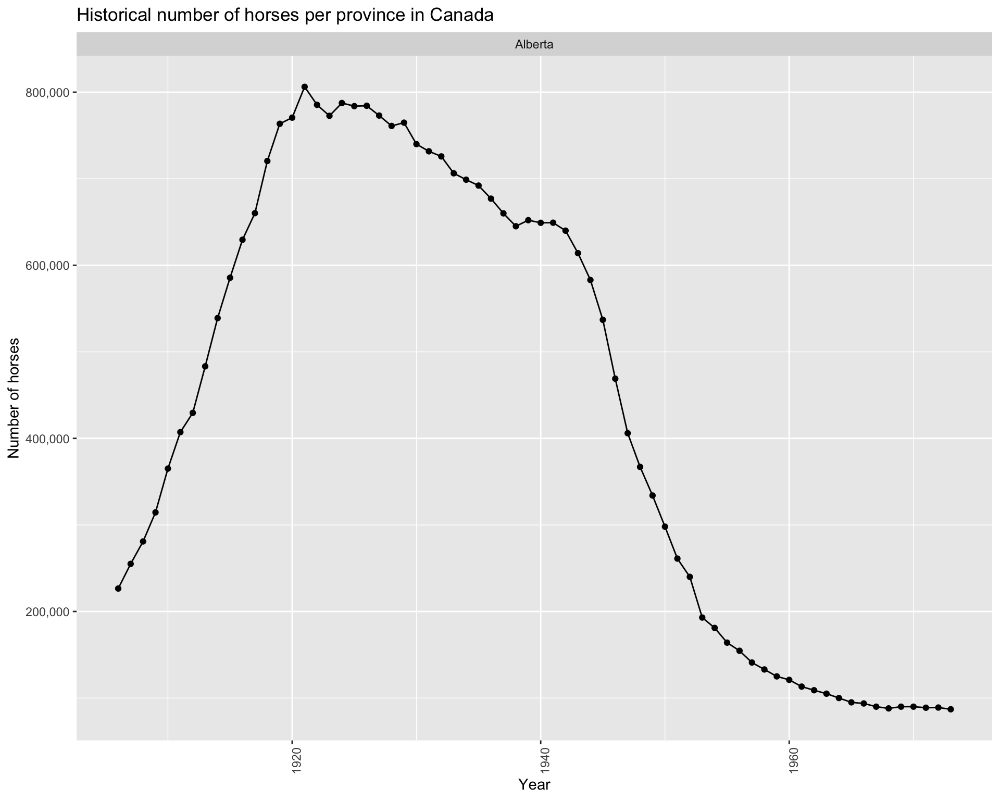

Historical horse population in Canada
================

-   [Aim](#aim)
-   [Data](#data)
-   [Methods](#methods)
-   [Results](#results)
-   [References](#references)

## Aim

This project explores the historical population of horses in Canada
between 1906 and 1972 for each Province.

## Data

Horse population data were sourced from the [Government of Canada’s Open
Data website](http://open.canada.ca/en/open-data). Specifically, these
two sources were used:

-   [Horses, number on farms at June 1 and at December
    1](http://open.canada.ca/data/en/dataset/43b3a9b3-3842-45e7-8bc8-c4c27b9462ab)
-   [Horses, number on farms at June 1, farm value per head and total
    farm
    value](http://open.canada.ca/data/en/dataset/b374f60b-9580-44dc-83f6-c0a850c15f30)

## Methods

The R programming language \[@R\] and the following R packages were used
to perform the analysis: knitr \[@knitr\] and tidyverse \[@tidyverse\].
The code used to perform the analysis and create this report can be
found here: <https://github.com/ttimbers/equine_numbers_value_canada_rmd>.

## Results

<!-- -->

We can see from the visualisation above that Ontario, Saskatchewan and
Alberta have had the highest horse populations in Canada. All provinces
have had a decline in horse populations since 1940. This is likely due
to the rebound of the Canadian automotive industry after the Great
Depression and the Second World War. An interesting follow-up
visualization would be car sales per year for each Province over the
time period visualised above to further support this hypothesis.

Next we look at the range of the number horses for each provinces at any
time point between 1940 - 1972:

| Province             | Maximum | Minimum |
|:---------------------|--------:|--------:|
| Alberta              |  806200 |   87000 |
| British Columbia     |   65200 |   22500 |
| Manitoba             |  370800 |   31000 |
| New Brunswick        |   71000 |    3200 |
| Nova Scotia          |   64500 |    3600 |
| Ontario              |  822300 |   75400 |
| Prince Edward Island |   36700 |    2200 |
| Quebec               |  378800 |   39000 |
| Saskatchewan         | 1104300 |   58000 |

Table 1. Maximum and minimum number of horses for each province between
1940 - 1972

Below we zoom in and look at the province of Alberta:

<!-- -->
